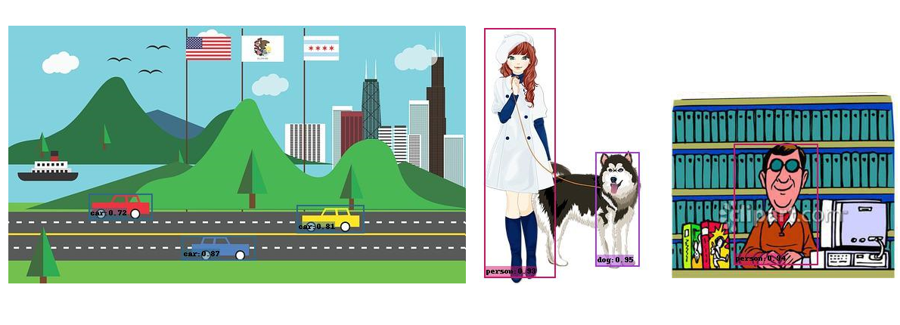

# Cross-Domain Object Detection with Online Style Transfer in PyTorch

The objective of this repository is to replicate and extend upon [Cross-Domain Weakly-Supervised Object Detection through Progressive Domain Adaptation)](https://openaccess.thecvf.com/content_cvpr_2018/html/Inoue_Cross-Domain_Weakly-Supervised_Object_CVPR_2018_paper.html). The implementation is based upon [High quality, fast, modular reference implementation of SSD in PyTorch](https://github.com/lufficc/SSD) and [Unofficial pytorch implementation of AdaIN](https://github.com/naoto0804/pytorch-AdaIN). The results of this project can be found in our academic report paper [here](https://drive.google.com/file/d/1naaAcrRGMK7vxUmj_iRbpKZsqQLq5IpY/view?usp=sharing).

  
  
  
Detection results before (baseline) and after (adain).

## Setup

For a thorough explanation on how we executed, or how to replicate our experiment please refer to these notebooks: [ssd+adain](https://colab.research.google.com/drive/1pZ-OorwGDpRUHazasamHE8wu26MLtOoo?usp=sharing), [cyclegan](https://drive.google.com/file/d/1ly6uhF1oX6lHt3HYwdtoMbjeK-JTp0AT/view?usp=sharing).
For further details on how to setup your environment you may check the original authors recommendations.

## Results

We make available the models as explained in the paper linked above.
The performance is evaluated on Clipart1k test split, you can find more about it [here](https://drive.google.com/file/d/1ly6uhF1oX6lHt3HYwdtoMbjeK-JTp0AT/view?usp=sharing)

| Name           | Configuration    |  mAP       |  Download |
| :------------: | :--------------: | :--------: | :-------: |
|  baseline      |     setup_3      |  25.86     | [model](https://drive.google.com/file/d/1CM7n967gnIeX7cvT_EJ4RdDWsEMkG2Q5/view?usp=sharing)   |
|  cyclegan      |     eval_1       |  31.95     | [model](https://drive.google.com/file/d/1zExtvJScKrIlEPpQ5Z5X5z2mM3pEUMy9/view?usp=sharing)   |
|  adain         |     style_1      |  39.25     | [model](https://drive.google.com/file/d/1CyfA3ZkbXXvL4M8CDNdUHKe7P_s3l-MS/view?usp=sharing)   |
